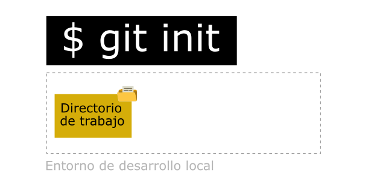
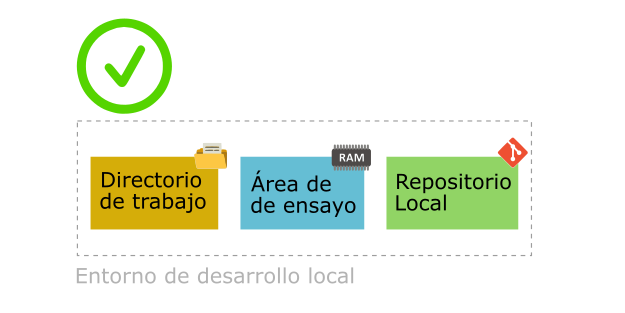
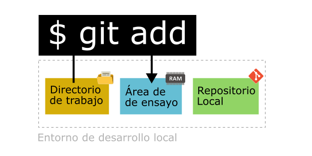
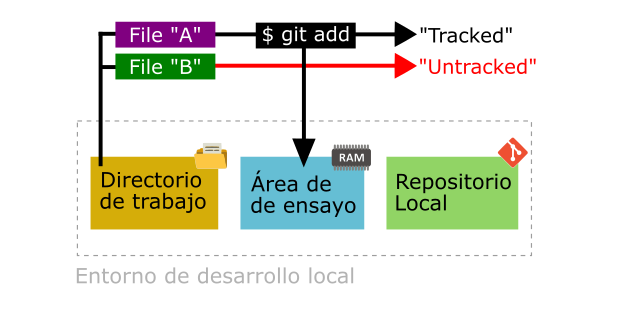
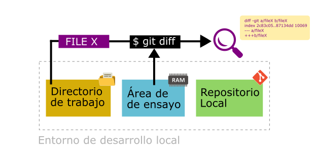
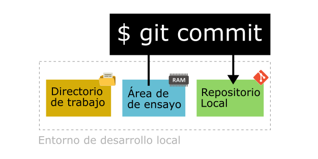

# GIT-101

Git Quick Reference Blog - Referencia rápida para usar GIT | Notas personales del Curso de platzi.com | Fecha: 20220820

## Contenido

* [1. Preparar un repositorio a tu entorno de desarrollo local.](https://github.com/ldmaroto/git-blog#1-preparar-un-repositorio-a-tu-entorno-de-desarrollo-local)
* [2. Agregar o eliminar cambios a su repositorio local.](https://github.com/ldmaroto/git-blog#2-agregar-o-eliminar-cambios-a-su-repositorio-local)
* [3. Crear una instantanea del área de trabajo en la base de datos del repositorio.](https://github.com/ldmaroto/git-blog#3-crear-una-instantanea-del-%C3%A1rea-de-trabajo-en-la-base-de-datos-del-repositorio)
* [4. Traer un archivo de una instantánea del repositorio al entorno de trabajo](https://github.com/ldmaroto/git-blog#4-traer-un-archivo-de-una-instant%C3%A1nea-del-repositorio-al-entorno-de-trabajo)
* [5. Observar contenido del respositorio.](https://github.com/ldmaroto/git-blog#5-observar-contenido-del-respositorio)
* [6. Eliminar cambios del repositorio.](https://github.com/ldmaroto/git-blog#6-eliminar-cambios-del-repositorio)
* [7. Sobre flujo de trabajo de un repositorio remoto.](https://github.com/ldmaroto/git-blog#7-sobre-flujo-de-trabajo-de-un-repositorio-remoto)
* [8. Tags y versiones en Git y GitHub.](https://github.com/ldmaroto/git-blog#8-tags-y-versiones-en-git-y-github)
* [9. Crear una rama.](https://github.com/ldmaroto/git-blog#9-crear-una-rama)
* [10. Crear llaver SSH para conectar el repositorio local con un repositorio remoto.](https://github.com/ldmaroto/git-blog#10-crear-llaver-ssh-para-conectar-el-repositorio-local-con-un-repositorio-remoto)
* [11. Cofigurar Github para usar el protocolo SSH.](https://github.com/ldmaroto/git-blog#11-cofigurar-github-para-usar-el-protocolo-ssh)
* [Anexo 1. Notas adicionales.](https://github.com/ldmaroto/git-blog#anexo-1-notas-adicionales)

## 1. Preparar un repositorio a tu entorno de desarrollo local

Permite crear dos cosas: un área de ensayo (staging) en la memoria RAM y una carpeta para la base de datos del repositorio (la carpeta conocida como "/.git/"), donde se guardan los cambios atómicos de nuestro código:

```bash
git init
```




Área de ensayo es un área de preparación donde se envía los archivos antes de enviarlos a la base de datos de cambios históricos de su código o proyecto, conocido tambien como "Repositorio Local".

## 2. Agregar o eliminar cambios a su repositorio local

Una vez creado el repositorio, los archivos de su entorno de desarrollo local tendrán dos posibles estados:  "Tracked" o "Untracked". GIT se encarga de monitorear cambios a solo los archivos que poseen el estado "Tracked". Si un archivo está "Tracked" y el mismo fue modificado, GIT le indicará cuando es necesario incluirlo nuevamente a tu área de ensayo (staging), antes de publicar dicho cambio al repositorio local.

### Agregado cambios a su repositorio local

Durante el desarrollo de un codigo, es normal hacer cambios a los archivos del directorio de trabajo, o crear archivos temporales. Para agregar o "registrar" los cambios al repositorio local, debe primero incluir los archivos en el área de ensayo (staging), permitiendo a GIT verificar automaticamente sus cambios. Utilice el siguiente comando para incluir cambios a la base de datos de cambios históricos del repositorio:

```bash
git add <parametro>
```




Si utiliza el parametro ".", se agregá todos los archivos de su directorio de trabajo con estado "Untracked" a tu área de ensayo (staging). Tambien puedes indicar el nombre individual de un archivo específico, de acuerdo al siguiente ejemplo:

```bash
git add .
git add <nombre_de_archivo>
```

Para mostrar los diferentes estados de los archivos en su entorno de desarrollo local, utilice este comando:

```bash
git status
```

Para observar los cambios que GIT detectó, entre el directorio de trabajo y su área de ensayo (staging), escriba el siguiente comando:

```bash
git diff
```



### Eliminar archivos del repositorio local

Para eliminar un archivo del repositorio local, utilize:

```bash
git rm
```

Advertencia: Recuerde que el archivo se eliminará del repositorio local y del directorio de trabajo.

### Eliminar archivos que ingresaron al área de ensayo

Si recientemente se incluyó un archivo al área de ensayo, puede revertir ese paso con el siguiente comando:

```bash
git rm --cached <archivo>
```

Recuerde que no se eliminará del directorio de trabajo.

## 3. Crear una instantanea del área de trabajo en la base de datos del repositorio

Para registrar una instantánea permanente de tu área de trabajo (staging) en la base de datos del repositorio. El nombre por defecto del repositorio es "master". Si se omite la bandera -m, Git llamará un editor de texto para completar el comentario, por defecto se usa VIM, pero puede usted programar otros como Visual Studio Code. Todo "commit" con mensajes vacíos, será abortado.

```bash
git commit -m "<Comentario>"
```



Recordar que para hacer un "commit", Git necesita saber quienes somos nosotros, para ello necesitas correr antes estos comandos, en el entorno global de Git:

```bash
git config --global user.email "<correo_electronico>"
git config --global user.name "<nombre_de_usuario>"
```

Si necesita ver la configuración por defecto de tu "Git", use este comando:

```bash
git config --list
```

Si necesita ver donde está guardado la configuración de tu "Git", use este comando:

```bash
git config --list --show-origin
```

Una vez realizado el "commit", lo siguiente presenta los cambios en el repositorio:

```bash
git log
git log <archivo>
```

Lo siguiente presenta los "cambios específicos" de los archivos a partir de creado el "commit". Ante muchos cambios, se usan las fechas "up/donw" para moverse en la pantalla y la tecla "q" para salir:

```bash
git log --stat
git log --stat <archivo>
```

Si necesita ver con detalle los cambios de un determinado archivo en el repositorio (presentará todos los commit que afectaron al archivo), utilice:

```bash
git show <archivo>
```

Para comparar los cambios entre dos imagenes de tu base de datos de repositorio:

```bash
git diff <commit-id.old> <commit-id.new>
```

## 4. Traer un archivo de una instantánea del repositorio al entorno de trabajo

Traer la imagen de un archivo, de una instatánea de la base de datos hacia el entorno de trabajo. Es importante conocer la referencia de la instantanea de la base de datos del reposotorio, conocido como <commit-id>, el cual es una cadena de caracteres y números. Se puede reemplazar el <commit-id> por el nombre de la rama, ejemplo "master".
  
```bash
git checkout <commit-id> <archivo>
```

## 5. Observar contenido del respositorio

En paso anterior, se mencionó sobre la referencia de la instantanea de la base de datos del repositorio, llamado <commit-id>. El siguiente comando, podrá ver el registro de todos los <commit-id> de la base de datos del repositorio:
  
```bash
git log
```

Lo mismo del punto anterior, pero aplicado a un archivos específico:

```bash
git log <archivo>
```

## 6. Eliminar cambios del repositorio

Advertencia!!!: Se utiliza sobre todo para deshacer las cosas. Puede borrar todo el historial del repositorio. Uselo entendiendo lo que está haciendo. "Hard" elimina el contenido del área de trabajo (staging), y "Soft" lo mantiene.

```bash
git reset --hard
git reset --soft
```

Para eliminar archivos del área de trabajo (staging). No para borrarlos del entorno de trabajo, solo para que los últimos cambios de estos archivos no se envíen al próximmo "commit"

```bash
git reset HEAD
```

## 7. Sobre flujo de trabajo de un repositorio remoto

Permite descargar los archivos de la última versión de la rama principal y todo el historial de cambios en la carpeta "/.git/":

```bash
git clone url_del_servidor_remoto
```

Ejecutar este comando para mandar los cambios al servidor remoto:

```bash
git push
```

Para traer actualizaciones del servidor remoto y guardarlas en nuestro repositorio local (en caso de que hayan, por supuesto).

```bash
git fetch
```

Lo necesitamos para combinar los últimos cambios del servidor remoto y nuestro directorio de trabajo:

```bash
git merge
```

Cumple las funciones de "git fetch" y "git merge" al mismo tiempo:

```bash
git pull
```

## 8. Tags y versiones en Git y GitHub

Una manera simple de ver tags en tu repositorio local es con el comando:

```bash
git tags
```

Antes de aprender a crear tags, la siguiente linea de comando presenta una resumen comprimido del historial de la base de datos del repositorio. Es muy util para buscar los "commit-id":

```bash
git log --all --graph --decorate --oneline
```

Como resultado tendrá una respuesta similar a esto:

```bash
$ git log --all --graph --decorate --oneline
* 6dbbb7d Cambio de imagen
* 75ec0e3 Mas cambios de contenido
* 56c77fc Mas cambios de contenido
* c794aa9 Prueba de git rm...
* 84942d1 Mas cambios
```

Para crear un tag, utilize esta linea de comando:

```bash
git tag -a <numero_versión> -m "<comentario>" <commit-id>
```

Para subir los tag al repositorio remoto, escriba el comando:

```bash
git push origin --tags
```

## 9. Crear una rama

Basicamente es copiar una rama existente, por lo general "master", para hacer cambios sin afectar la rama principal, siempre se creará desde la rama donde apunta HEAD:

```bash
git branch <nombre_de_rama> 
```

## 10. Crear llaver SSH para conectar el repositorio local con un repositorio remoto

Puede vincular el repositorio local con un repositorio remoto. Para asegurar la comunicación, es aconsejable usar el protocolo SSH. Para ello es necesario crear llaves SSH. Siga los pasos es [ssh-blog](https://github.com/ldmaroto/ssh-blog).

## 11. Cofigurar Github para usar el protocolo SSH

El primer paso es subir la llave pública a su perfil de usuario de Github, en [Github.com|Ajustes|Llaves](https://github.com/settings/keys), en el boton "New SSH", podrá agregar el contenido de la llave. Utilice un nombre representativo a su llave.

En el repositorio, localice el boton verde llamado "Clone or download", escoja la opción "Use SSH". Si antes no has agregado una llave pública, en este momento Github te dará una advertencia de hacerlo. Seguidamente el repositorio usará el protocolo SSH en lugar de HTTPS. Copie la nueva URL, que es algo similar a: "git@github.com:usuario/xxxx.git" (donde xxxx es el nombre de su repositorio en Github). Apunte esta URL que la usará más adelante (git@github.com:....).

En la consola de terminal, escriba el siguiente comando, y podrá ver la configuración actual de las URLs que usan el protocolo HTTP:

```bash
git remote -v 
```

Seguidamente defina un repositorio remoto en el repositorio local:

```bash
git remote add origin <https://github.com/....> 
```

Para cambiar a un protocolo SSH, basta con cambiar la URL del repositorio remoto, con este comando:

```bash
git remote set-url origin <git@github.com:....>
```

Finalmente proceda con este comando para verificar que hay comunicación entre los repositorios vía SSH

```bash
git pull origin master
```

Verá aparecer el siguiente mensaje indicando que todo está bien:

```bash
$ git pull origin master
From github.com:ldmaroto/ssh-blog
 * branch            master     -> FETCH_HEAD
Already up to date.
```

## Multiples entornos de trabajo

### Git Rebase

El uso de este comando es considerado una mala práctica, permite tomar todos los cambios confirmados en una rama y reubicarlos en otra rama.

Primero, cambiamos a la rama que queremos traer los cambios:

```bash
git checkout dev-master 
```

Segundo, aplicamos rebase para traer los cambios de la rama que queremos

```bash
git checkout master 
```

### Git Stash

Este comando es muy util para estamos haciendo cambios que no merecen una rama o no merecen un rebase, sino simplemente estamos probando algo y luego quiremos volver rápidamente a la versión anterior, la cual es la correcta.

```bash
git stash 
```

### Git Clean

Cuando tenemos archivos termporales, porque son el resultado de una compilación de código, y no queremos que estos formen parte del repositorio, tenemos una forma rápida de borrarlos:

Primero, para desplegar cuales archivos se pueden eliminar:

```bash
git clean --dry-run 
```

Para eliminarlos de forma definitiva:

```bash
git clean -f 
```

### Git Cherry-pick

Otro ejemplo de comando que forma parte de las malas prácticas de Git.

```bash
git cherry-pick <commit-id> 
```

## Comandos para casos de emergencia

### Git Commit --amend

Si resulta que no queríamos enviar un commit porque faltaba algo más, utilizaremos el siguiente comando para adjuntar el cambio al commit enviado (amend en inglés es remendar):

```bash
git commit --amend 
```

### Git Reset y Reflog

El "Git Reflog", es un comando mas detallado que el "Git Log", no solo muestra los "commit-id", sino tambien los "Heads" que se han eliminado.

```bash
git reflog 
```

Para restablecer el historial y mantener lo que tengas en staging ahí:

```bash
git reset --soft <HashDelHEAD>
```

Para restablecer el historial y resetea absolutamente todo incluyendo lo que tengas en staging.

```bash
git reset --hard <HashDelHEAD> 
```

## Anexo 1. Notas adicionales

Importante, a GIT no le interesa la carpetas, solo los archivos. Las carpetas son consideradas rutas de los archivos.
Nombre comunes de Ramas: master, development, hotfix.
