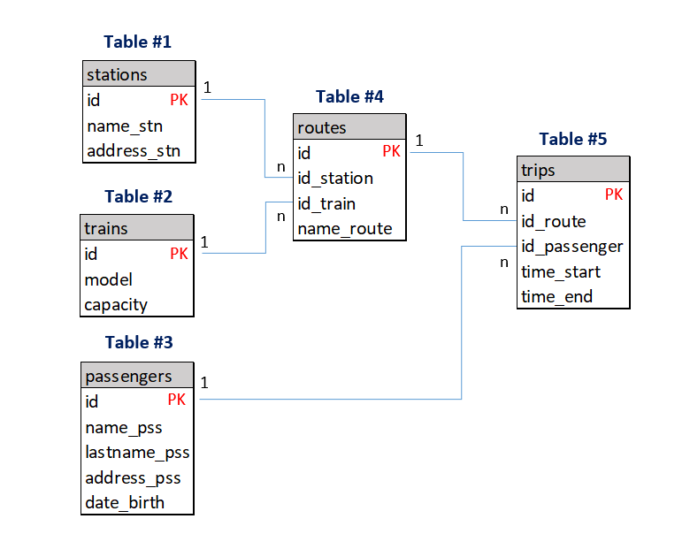

# Create Data Base

## Creando la Base de Datos

```sql
CREATE DATABASE transporte
    WITH
    OWNER = postgres
    ENCODING = 'UTF8'
    CONNECTION LIMIT = -1
    IS_TEMPLATE = False;
```

El código anterior crea una base de datos llamada "transporte". Al ejecutarlo, se creará una base de datos vacía con las siguientes propiedades:

* OWNER = postgres: Especifica que el usuario "postgres" será el dueño de la base de datos y tendrá control total sobre ella.
* ENCODING = 'UTF8': Especifica que la codificación de la base de datos será UTF8, que es una codificación de caracteres ampliamente utilizada que permite representar un gran número de caracteres de diferentes idiomas.
* CONNECTION LIMIT = -1: Especifica que no habrá límite en el número de conexiones que se pueden establecer a la base de datos.
* IS_TEMPLATE = False: Especifica que la base de datos no es una plantilla para crear otras bases de datos.

## Creando las tablas

Repasemos el modelo relacional...



**Tabla #1: "stations"**
```sql
CREATE TABLE public.stations
(
    id serial NOT NULL,
    name_stn character varying(20) NOT NULL,
    address_stn character varying,
    CONSTRAINT stations_pkey PRIMARY KEY (id)
);

ALTER TABLE IF EXISTS public.stations
    OWNER to postgres;

COMMENT ON TABLE public.stations
  IS 'Table #1: Stations';
```

**Tabla #2 "trains"**
```sql
CREATE TABLE public.trains
(
    id serial NOT NULL,
    model character varying(20) NOT NULL,
    capacity integer NOT NULL,
    CONSTRAINT trains_pkey PRIMARY KEY (id)
);

ALTER TABLE IF EXISTS public.trains
    OWNER to postgres;

COMMENT ON TABLE public.trains
  IS 'Table #2: Trains';
```

**Tabla #3 "passengers"**
```sql
CREATE TABLE public.passengers
(
    id serial NOT NULL,
    name_pss character varying(50) NOT NULL,
    lastname_pss character varying(50) NOT NULL,
    address_pss character varying NOT NULL,
    date_birth date NOT NULL,
    CONSTRAINT passengers_pkey PRIMARY KEY (id)
);

ALTER TABLE IF EXISTS public.passengers
    OWNER to postgres;

COMMENT ON TABLE public.passengers
  IS 'Table #3: Passengers';
```

**Tabla #4: "routes"**

```sql
CREATE TABLE public.routes
(
    id serial NOT NULL,
    id_station integer NOT NULL,
    id_train integer NOT NULL,
    name_route character varying(20) NOT NULL,
    CONSTRAINT routes_pkey PRIMARY KEY (id),
    CONSTRAINT stations_fkey FOREIGN KEY (id_station)
        REFERENCES public.stations (id) MATCH SIMPLE
        ON UPDATE NO ACTION
        ON DELETE NO ACTION
        NOT VALID,
    CONSTRAINT trains_fkey FOREIGN KEY (id_train)
        REFERENCES public.trains (id) MATCH SIMPLE
        ON UPDATE NO ACTION
        ON DELETE NO ACTION
        NOT VALID
);

ALTER TABLE IF EXISTS public.routes
    OWNER to postgres;

COMMENT ON TABLE public.routes
  IS 'Table #4: Routes';
```

**Tabla #5: "trips"**

```sql
CREATE TABLE public.trips
(
    id serial NOT NULL,
    id_route integer NOT NULL,
    id_passenger integer NOT NULL,
    CONSTRAINT trips_pkey PRIMARY KEY (id),
    CONSTRAINT routes_fkey FOREIGN KEY (id_route)
        REFERENCES public.routes (id) MATCH SIMPLE
        ON UPDATE NO ACTION
        ON DELETE NO ACTION
        NOT VALID,
    CONSTRAINT passengers_fkey FOREIGN KEY (id_passenger)
        REFERENCES public.passengers (id) MATCH SIMPLE
        ON UPDATE NO ACTION
        ON DELETE NO ACTION
        NOT VALID
);

ALTER TABLE IF EXISTS public.trips
    OWNER to postgres;

COMMENT ON TABLE public.trips
  IS 'Table #5: Trips';
```