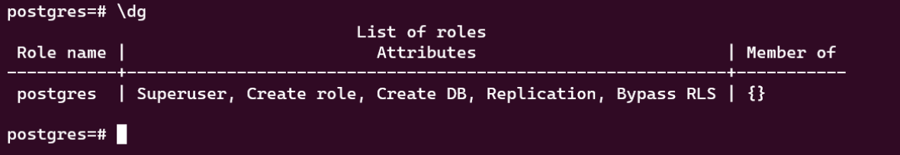
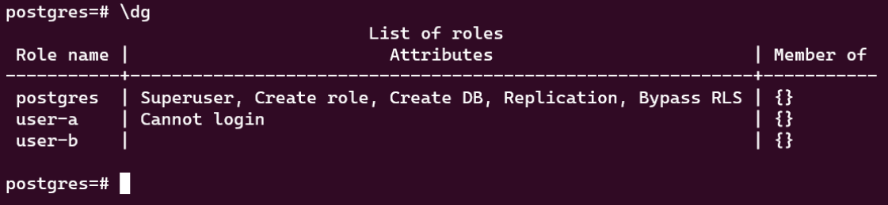

# ROLES

En PostgreSQL, un rol es un nombre de usuario que puede iniciar sesión y que tiene permisos para realizar ciertas acciones en la base de datos. Para crear un rol en PostgreSQL, puedes usar el siguiente comando:

```sql
CREATE ROLE nombre_rol WITH LOGIN PASSWORD 'contraseña'
```

Para asignar permisos a un rol, puedes usar el comando GRANT. Por ejemplo, para dar al rol lector permiso para seleccionar datos de todas las tablas de la base de datos mi_bd, puedes usar el siguiente comando:

```sql
GRANT SELECT ON ALL TABLES IN SCHEMA public TO lector;
```

Puedes usar el comando REVOKE para quitar permisos a un rol. Por ejemplo, para revocar el permiso para seleccionar datos del rol lector, puedes usar el siguiente comando:

```sql
REVOKE SELECT ON ALL TABLES IN SCHEMA public FROM lector;
```

## Características

* Crear y eliminar otros Roles
* Asignar atributos para hacer "Login", acceder a tablas...
* Agrupar roles
* Existen roles de forma predeterminada en Postgress. 

Hasta ahora hemos estado usando el Rol de "postgres" pero en la práctica es muy riesgoso usarlo porque este Rol tiene muchos privilegios.

## Roles desde la consola

Los roles son independientes de las bases de datos. Tengamo en mente algunos comandos útiles para la creación de los roles:

| Comando | Descripción |
| ------ | ------ |
| \h CREATE ROLE | Muestra la ayuda para crear un ROL |
| \dg | Muestra una lista de todos los roles creados |

En una instalación limpia de PostgreSQL, la consola mostrará mendiante el comando **"\dg"** la siguiente lista de los roles creados.



Esta lista no mostrará los roles de sistema. En PostgreSQL, los roles de sistema son roles especiales que tienen permisos especiales en el sistema y se usan para realizar tareas de mantenimiento y administración del sistema. Los roles de sistema tienen nombres que comienzan con el prefijo pg_ y no pueden ser eliminados o renombrados.

Algunos ejemplos de roles de sistema incluyen:

* **pg_signal_backend**: este rol tiene permiso para enviar señales a procesos de back-end de PostgreSQL.
* **pg_read_all_settings**: este rol tiene permiso para leer todas las configuraciones del sistema.
* **pg_monitor**: este rol tiene permiso para ver información de monitoreo del sistema, como el estado de los procesos de back-end y las consultas en ejecución.

En general, es recomendable no asignar roles de sistema a usuarios normales, ya que tienen demasiados permisos y pueden ser peligrosos si se usan de forma inadecuada. En su lugar, se recomienda crear roles con permisos más restringidos y asignar solo los permisos necesarios a cada rol.

## Creando Roles

Empesemos a ver cómo se define un ROLE y lo que ocurre dentro de PostgreSQL. Para ello vamos a crear nuestro primer ROLE:

```sql
CREATE ROLE "user-a";
```

Por defecto PostgreSQL incluirá atributos al nuevo ROLE. La linea anterior es equivalente a:

```sql
CREATE ROLE "user-a" WITH
	NOLOGIN
	NOSUPERUSER
	NOCREATEDB
	NOCREATEROLE
	INHERIT
	NOREPLICATION
	CONNECTION LIMIT -1;
```

De esta forma se crea se define un ROLE sin contraseña y con todas las características predeterminadas.

Despues de la versión 9.3 de PostgreSQL, se puede usar USER en lugar de ROLE. La diferencia entre ROLE y USER es la siguiente:

```sql
CREATE USER "user-b";
```

Es el equivalente a:

```sql
CREATE ROLE "user-b" WITH
	LOGIN
	NOSUPERUSER
	NOCREATEDB
	NOCREATEROLE
	INHERIT
	NOREPLICATION
	CONNECTION LIMIT -1;
```
CREATE USER asignará el atributo LOGIN al nuevo rol de forma predeterminada. CREATE ROLE no lo hará.



Entendido esto, borremos estos dos roles mediante el código: 

```sql
DROP USER "user-a", "user-b";
```

Ahora, empresemos por hacer nuestro primer **ROLE** correspondiente para un usuario destinado para consultas. 
Utilize la siguiente lista de requerimientos:

1. El nombre del nuevo rol es: "usr-query"
2. Tendrá acceso de login.
3. Podrá agregar (INSERT), leer (SELECT), escribir (UPDATE) registros, pero no podrá borrar tablas o bases de datos.
4. Su contraseña será: "123456".
5. Los privilegios se aplicará a todas las tablas de la base de datos llamada "Transporte".


```sql
CREATE USER "usr-query" WITH PASSWORD '123456';
```

Para entrar a la consola de PostgreSQL, se puede usar el siguiente comando en la terminal:

```bash
psql -h 127.0.0.1 -p 5432 -U user-query -d postgres
```

Para asignar los privilegios de "usr-query" sobre las tablas de la Base de Datos, puede usar el siguiente código SQL una vez que te encuentres conectado a la base de datos "transporte". Tambien lo puede hacer usando el "Grant Wizard" de pgAdmin.

```sql
GRANT INSERT, SELECT, UPDATE ON TABLE public.passengers TO "user-query";
GRANT INSERT, SELECT, UPDATE ON TABLE public.routes TO "user-query";
GRANT INSERT, SELECT, UPDATE ON TABLE public.stations TO "user-query";
GRANT INSERT, SELECT, UPDATE ON TABLE public.trains TO "user-query";
GRANT INSERT, SELECT, UPDATE ON TABLE public.trips TO "user-query";
```
