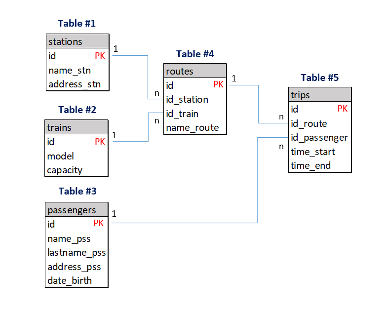

# Forein Keys

Las llaves foráneas son una característica de la base de datos que se utilizan para establecer y mantener la integridad referencial. Esto significa que aseguran que las relaciones entre las tablas de la base de datos se mantengan de manera coherente y consistente.

Cuando se agrega una llave foránea a una tabla, se establece una relación con otra tabla. Esto significa que los valores en la columna de la llave foránea deben coincidir con los valores en la columna de la tabla relacionada que se establece como la llave primaria. De esta manera, se evita la introducción de datos inconsistentes o incorrectos en la base de datos.

Por ejemplo, si tienes una tabla de "clientes" y otra tabla de "pedidos", puedes utilizar una llave foránea para asegurarte de que cada pedido esté asociado a un cliente válido. Esto se logra estableciendo la columna "id_cliente" de la tabla "pedidos" como una llave foránea que hace referencia a la columna "id" de la tabla "clientes".

En el contexto del estándar ACID, las llaves foráneas juegan un papel importante en la parte de la integridad de la base de datos. Ayudan a garantizar que los datos se mantengan consistentes y coherentes, lo que a su vez ayuda a cumplir con las demás partes del estándar ACID (atomicidad, aislamiento y durabilidad).

## Creando las relacionas de las tablas (Forein Keys)

Repasemos el modelo relacional...



Aplicamos las relaciones entre la tabla routes con las tablas stations y trains.

**Tabla #4: Routes**
```sql
ALTER TABLE IF EXISTS public.routes
    ADD CONSTRAINT routes_stations_fkey FOREIGN KEY (id_station)
    REFERENCES public.stations (id) MATCH SIMPLE
    ON UPDATE CASCADE
    ON DELETE RESTRICT
    NOT VALID;

ALTER TABLE IF EXISTS public.routes
    ADD CONSTRAINT routes_trains_fkey FOREIGN KEY (id_train)
    REFERENCES public.trains (id) MATCH SIMPLE
    ON UPDATE CASCADE
    ON DELETE RESTRICT
    NOT VALID;
```

Aplicamos las relaciones entre la tabla trips con las tablas passangers y trips.

**Tabla #5: Trips**
```sql
ALTER TABLE IF EXISTS public.trips
    ADD CONSTRAINT trips_passengers_fkey FOREIGN KEY (id_passenger)
    REFERENCES public.passengers (id) MATCH SIMPLE
    ON UPDATE CASCADE
    ON DELETE RESTRICT
    NOT VALID;

ALTER TABLE IF EXISTS public.trips
    ADD CONSTRAINT trips_routes_fkey FOREIGN KEY (id_route)
    REFERENCES public.routes (id) MATCH SIMPLE
    ON UPDATE CASCADE
    ON DELETE RESTRICT
    NOT VALID;
```

## Definición de Restricciones

**DEFERRABLE**

En PostgreSQL, "DEFERRABLE" es una opción que se puede utilizar al definir una llave foránea. Se utiliza para especificar si se deben aplicar las restricciones de integridad referencial de inmediato o si se deben posponer hasta el final de la transacción en curso.

Por defecto, las restricciones de integridad referencial se aplican de inmediato en PostgreSQL. Esto significa que, si se intenta insertar o actualizar una fila de manera que viola una restricción de integridad referencial, se producirá un error y la operación no se completará. 

Sin embargo, si se establece la opción "DEFERRABLE", las restricciones de integridad referencial se pospondrán hasta el final de la transacción. Esto significa que se pueden realizar varias operaciones en la base de datos sin que se produzcan errores por violaciones de integridad referencial, y luego se verificará al final de la transacción si se han violado o no las restricciones. Si se han violado, se producirá un error y la transacción no se confirmará. Si no se han violado, la transacción se confirmará y los cambios se guardarán en la base de datos.

"DEFERRABLE" es útil en algunos casos en los que se desea realizar varias operaciones en la base de datos sin que se produzcan errores por violaciones de integridad referencial, pero aún se quiere garantizar que se cumplan las restricciones al final de la transacción. Es importante tener en cuenta que, si se utiliza "DEFERRABLE", es necesario recordar confirmar o revertir la transacción manualmente para aplicar o revertir los cambios en la base de datos.

**DEFERRABLE INITIALLY DEFERRED**

"DEFERRABLE INITIALLY DEFERRED" es útil en algunos casos en los que se desea realizar varias operaciones en la base de datos sin que se produzcan errores por violaciones de integridad referencial, pero aún se quiere garantizar que se cumplan las restricciones al final de la transacción. Es importante tener en cuenta que, si se utiliza "DEFERRABLE INITIALLY DEFERRED", es necesario recordar confirmar o revertir la transacción manualmente para aplicar o revertir los cambios en la base de datos. Además, hay que tener en cuenta que las restricciones se iniciarán pospuestas por defecto, lo que significa que se deben habilitar manualmente durante la transacción si se desean aplicar antes del final de la transacción.

**"NOT VALID"**

En PostgreSQL, "NOT VALID" es una opción que se puede utilizar al definir una llave foránea. Se utiliza para especificar que la restricción de integridad referencial no se debe validar inmediatamente después de crearla. En lugar de eso, se deja como "no válida" y se puede validar más tarde mediante la utilización del comando "VALIDATE CONSTRAINT".

La opción "NOT VALID" es útil en algunos casos en los que se desea crear una restricción de integridad referencial, pero no se desea que se valide inmediatamente. Por ejemplo, si se está cargando un gran conjunto de datos en una tabla y se desea crear una restricción de integridad referencial para asegurar la coherencia de los datos, se puede utilizar "NOT VALID" para evitar que se valide la restricción mientras se cargan los datos. Una vez que se haya completado la carga de datos, se puede utilizar el comando "VALIDATE CONSTRAINT" para validar la restricción y asegurar que todos los datos cumplan con la restricción de integridad referencial.

## Definición de Acciones

En PostgreSQL, hay varias formas de definir las relaciones con llaves foráneas:

1. ON DELETE CASCADE: Esta opción se utiliza para especificar qué debe suceder con los datos en la tabla que tiene la llave foránea cuando se elimina una fila de la tabla de la llave primaria. Si se establece como "ON DELETE CASCADE", todas las filas en la tabla de la llave foránea que hacen referencia a la fila eliminada en la tabla de la llave primaria también serán eliminadas. Se mantiene la integridad con el riesgo de perder los datos de todas las tablas que posean las llaves foraneas cuando se elimina los datos en las tablas que posean las llaves primarias.

2. ON UPDATE CASCADE: Esta opción se utiliza para especificar qué debe suceder con los datos en la tabla que tiene la llave foránea cuando se actualiza una fila de la tabla de la llave primaria. Si se establece como "ON UPDATE CASCADE", todas las filas en la tabla de la llave foránea que hacen referencia a la fila actualizada en la tabla de la llave primaria también serán actualizadas para tener el nuevo valor de la columna de la llave primaria. La integridad de los datos se mantendrán.

3. ON DELETE SET NULL: Esta opción se utiliza para especificar qué debe suceder con los datos en la tabla que tiene la llave foránea cuando se elimina una fila de la tabla de la llave primaria. Si se establece como "ON DELETE SET NULL", todas las filas en la tabla de la llave foránea que hacen referencia a la fila eliminada en la tabla de la llave primaria tendrán el valor de la columna de la llave foránea establecido en NULL.

4. ON UPDATE SET NULL: Esta opción se utiliza para especificar qué debe suceder con los datos en la tabla que tiene la llave foránea cuando se actualiza una fila de la tabla de la llave primaria. Si se establece como "ON UPDATE SET NULL", todas las filas en la tabla de la llave foránea que hacen referencia a la fila actualizada en la tabla de la llave primaria tendrán el valor de la columna de la llave foránea establecido en NULL.

5. ON DELETE NO ACTION: Se utiliza para especificar qué debe suceder con los datos en la tabla que tiene la llave foránea cuando se elimina una fila de la tabla de la llave primaria. Si se establece como "ON DELETE NO ACTION", se permitirá eliminar la fila de la tabla de la llave primaria si hay filas en la tabla de la llave foránea que hacen referencia a ella. No se producirá un error y la eliminación se llevará a cabo. La integridad de los datos se perderá.

6. ON UPDATE NO ACTION: Se utiliza para especificar qué debe suceder con los datos en la tabla que tiene la llave foránea cuando se actualiza una fila de la tabla de la llave primaria. Si se establece como "ON UPDATE NO ACTION", se permitirá actualizar la fila de la tabla de la llave primaria si hay filas en la tabla de la llave foránea que hacen referencia a ella. No se producirá un error y la actualización se llevará a cabo. La integridad de los datos se perderá.

7. ON DELETE RESTRICT: Si se establece como "ON DELETE RESTRICT", no se permitirá eliminar la fila de la tabla de la llave primaria si hay filas en la tabla de la llave foránea que hacen referencia a ella. En lugar de eso, se producirá un error y la eliminación no se llevará a cabo.

8. ON UPDATE RESTRICT: Se utiliza para especificar qué debe suceder con los datos en la tabla que tiene la llave foránea cuando se actualiza una fila de la tabla de la llave primaria. Si se establece como "ON UPDATE RESTRICT", no se permitirá actualizar la fila de la tabla de la llave primaria si hay filas en la tabla de la llave foránea que hacen referencia a ella. En lugar de eso, se producirá un error y la actualización no se llevará a cabo.